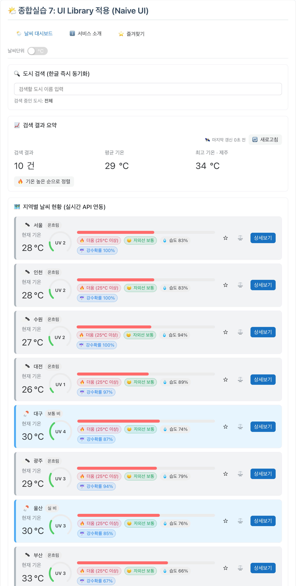
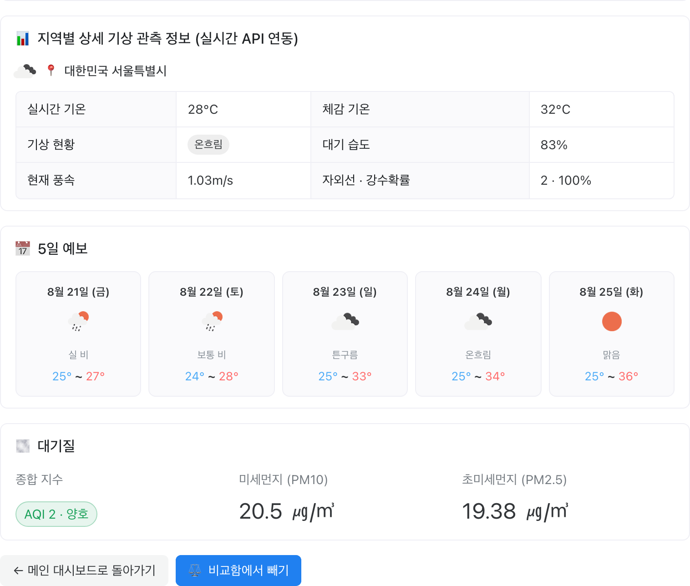
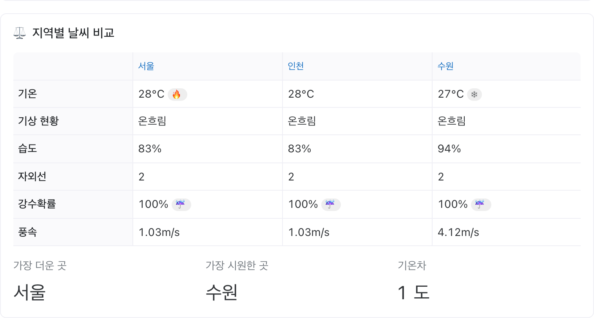
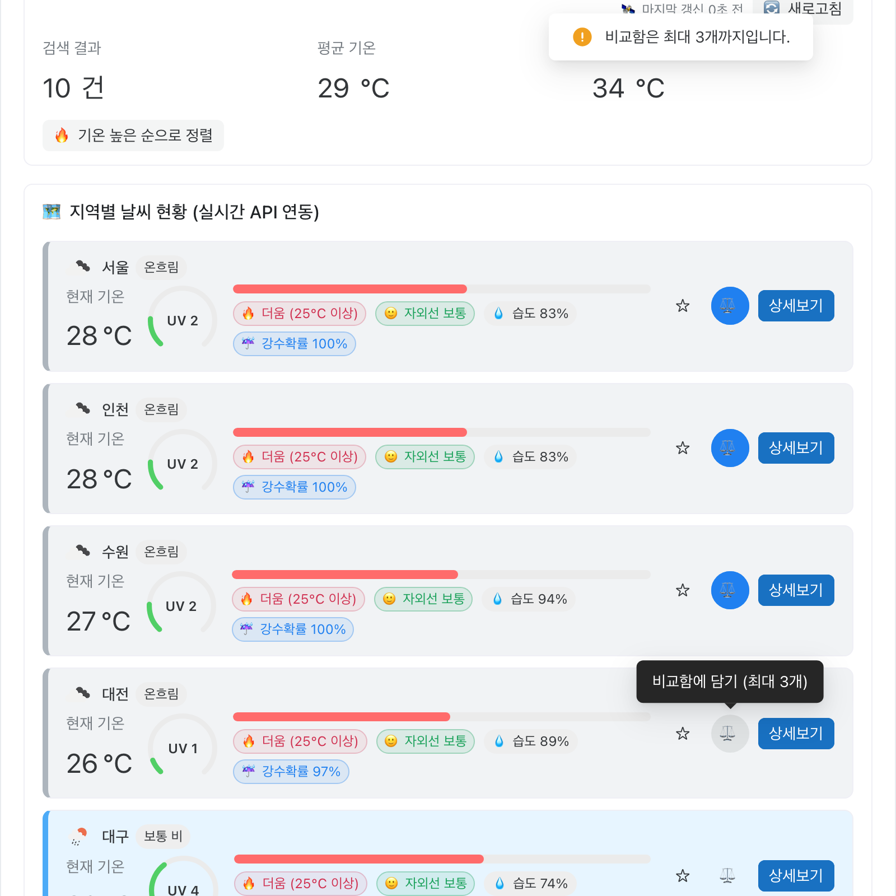
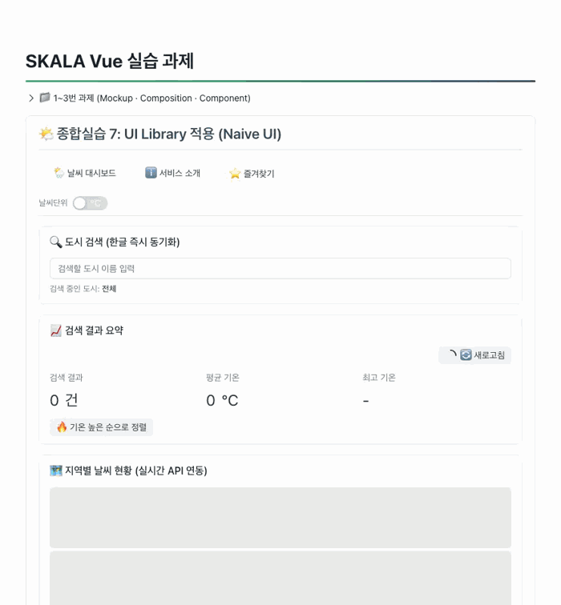
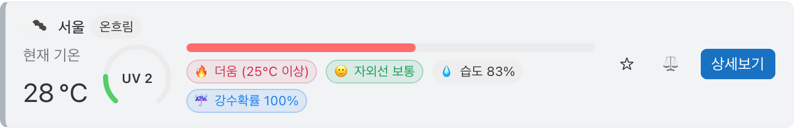
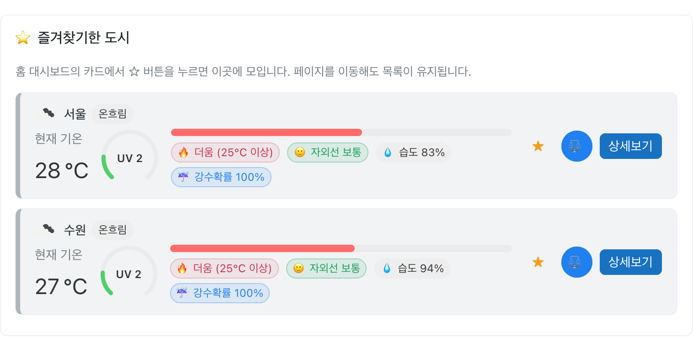
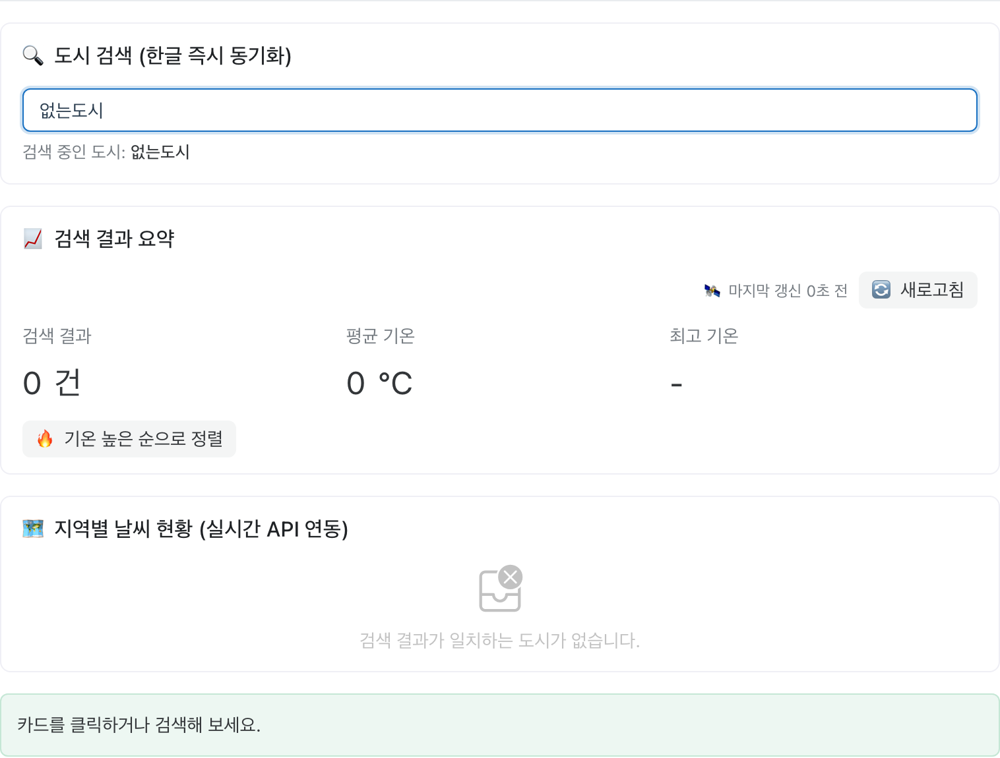
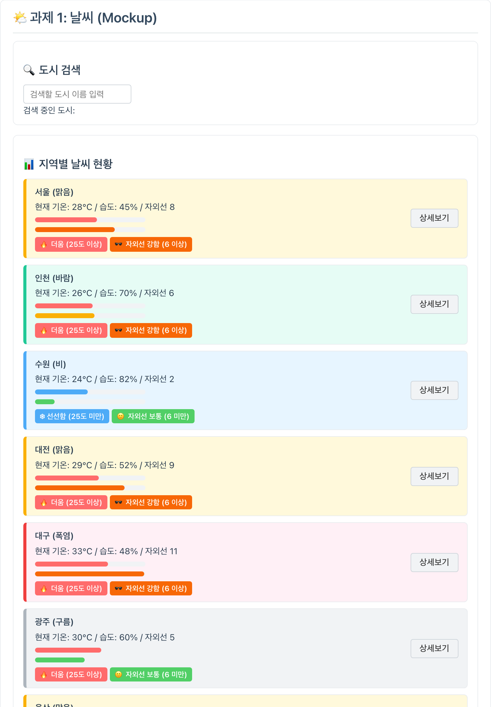
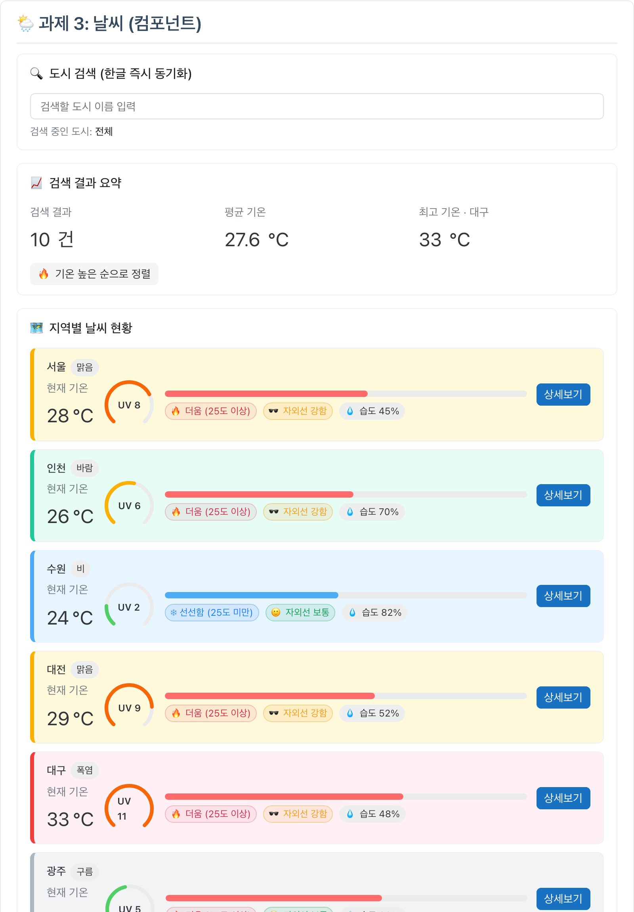

# SKALA Vue 실습 과제

SKALA Vue 강의의 실습 과제 저장소입니다. 과제 1부터 종합실습 8까지 같은 날씨 앱을 이어서 고쳐 왔고,
과제별 결과물을 지우지 않고 한 화면에 쌓아 두어 무엇이 어떻게 바뀌었는지 비교할 수 있게 했습니다.

## 실행 방법

배포 주소: **https://skala-vue-ruddy.vercel.app**

```sh
npm install
cp .env.example .env   # 발급받은 OpenWeatherMap 키를 채웁니다
npm run dev
```

| 페이지 | 주소 | 내용 |
| --- | --- | --- |
| **실습 과제** | **http://localhost:5173/** | 과제 결과물 (과제 1부터 종합실습 8까지) |
| 강의 예제 | http://localhost:5173/practice.html | 수업 중 따라 친 문법 예제 |

---

## 사용한 API

전부 종합실습 6에서 붙였습니다. 호출부는 [`src/api/`](src/api/)에 있습니다.

| API | 엔드포인트 | 키 |
| --- | --- | --- |
| **OpenWeatherMap** — 현재 날씨 · 5일 예보 · 대기 오염 | `/data/2.5/weather` · `/forecast` · `/air_pollution` | 필요 |
| **Open-Meteo** — 자외선 · 강수확률 | `/v1/forecast` | 불필요 |

OpenWeatherMap 무료 플랜에 자외선 지수가 없어 Open-Meteo를 함께 씁니다.

---

## 사용한 라이브러리

| 라이브러리 | 도입 시점 | 쓴 곳 |
| --- | --- | --- |
| [Vue](https://vuejs.org) 3 | 과제 1 | Composition API · `<script setup>` |
| [Vue Router](https://router.vuejs.org) | 과제 4 | [`router/exercise.js`](src/router/exercise.js) |
| [Pinia](https://pinia.vuejs.org) | 종합실습 5 | [`src/stores/`](src/stores/) — config · favorite · compare · weather |
| [Axios](https://axios-http.com) | 종합실습 6 | [`src/api/`](src/api/) — 인스턴스에 공통 설정 |
| [Naive UI](https://www.naiveui.com) | 종합실습 7 | [`plugins/naive.js`](src/plugins/naive.js) — CSS-in-JS라 전역 CSS와 안 부딪힘 |

---

## 화면

### 메인 대시보드

10개 도시의 **실시간 관측값**입니다. 아래 화면들의 숫자는 모두 촬영 시점의 실제 API 응답이라
과제 1–3 블록의 Mock 데이터와는 다릅니다.



### 한글 검색 — 조합 중에도 즉시 반영

`ㄷ` → `대` → `대ㄱ` → `대구`로 치는 동안 결과가 2건에서 1건으로 좁혀집니다. **조합이 끝나기를 기다리지 않고**
글자가 만들어지는 중간 단계까지 그대로 검색어에 반영됩니다.
`v-model`을 썼다면 `대구`가 완성될 때까지 아무 일도 일어나지 않습니다. → [과제 1](#과제-1--날씨-mockup)


### 도시 상세 — 5일 예보와 대기질

한 화면에서 API 3종을 씁니다. → [종합실습 6](#종합실습-6--날씨-axios)



### 도시 비교 — 담기 규칙과 화면 이동

카드에서 담고, 라우트를 옮겨도 트레이가 유지되고, 4번째를 담으려 하면 이유를 알려 줍니다. → [종합실습 5](#종합실습-5--날씨-store)


| 비교 결과 | 최대 3개 제한 |
| --- | --- |
|  |  |

### 섭씨 ↔ 화씨 — 바뀌는 것과 안 바뀌는 것

숫자와 라벨 속 기준값(`25°C 이상` → `77°F 이상`)은 함께 바뀌지만,
**게이지 길이와 🔥 더움 판정은 그대로**입니다. 판정은 계속 원본 섭씨로 하기 때문입니다. → [종합실습 5](#종합실습-5--날씨-store)



| 섭씨 | 화씨 |
| --- | --- |
|  |  |

### 나머지 화면

| 즐겨찾기 | 검색 결과 없음 | 404 |
| --- | --- | --- |
|  |  |  |

### 과제 1 · 과제 3 결과물

지우지 않고 접어 두었습니다. 같은 Mock 데이터를 쓰는데 과제 1은 손으로 짠 CSS,
과제 3은 컴포넌트로 쪼갠 뒤 종합실습 7에서 Naive UI로 갈아입은 모습입니다.
과제 3 화면에 **즐겨찾기·비교 버튼이 없고 섭씨로 고정**된 것은 의도한 것입니다. → [과제 4](#과제-4--날씨-router)

| 과제 1 (순수 HTML/CSS) | 과제 3 (컴포넌트 + Naive UI) |
| --- | --- |
|  |  |

---

## 요구사항 충족 현황

과제별 hands-on 요구사항 34개와 배포 항목입니다.

### 과제 1 (Mockup)

- [x] **1** 배열 렌더링 `v-for` + `:key`에 id 바인딩 → [화면](#과제-1--과제-3-결과물)
- [x] **2** 조건부 렌더링 `v-if` — 25도 기준 라벨 분기 → 카드의 `🔥 더움` / `❄ 선선함`
- [x] **3** `v-model` 대신 `:value` + `@input` (한글 처리) → [GIF](docs/clips/search-ime.gif)
- [x] **4** 이벤트 수식어 — 상세보기는 버블링 없이 → [`WeatherMockup.vue`](src/components/exercise/WeatherMockup.vue)의 `@click.stop`
- [x] **5** 본인만의 데이터 추가 → 도시 10개 + `humidity` `uv` 필드

### 과제 2 (Composition)

- [x] **1** 반응형 상태 `ref` 3종 → [`WeatherComposition.vue`](src/components/exercise/WeatherComposition.vue)
- [x] **2** 검색 도시 `computed` → `filteredWeatherList`
- [x] **3** `watch` / `watchEffect`로 변화 감시 → 콘솔 로그
- [x] **4** 검색 결과 3분기 (빈 검색어 / 일치 / 불일치) → [검색 결과 없음](docs/screenshots/search-empty.png)
- [x] **5** 본인만의 상태 · computed · watcher → 정렬 토글, 통계 3종, 자외선 경보

### 과제 3 (Component)

- [x] **1** `WeatherParent.vue` — 모든 반응형 데이터 보유 → [화면](#과제-1--과제-3-결과물)
- [x] **2** `BaseDashboardCard.vue` — 박스 공통화 + `<slot>` → 검색·요약·목록 3곳 재사용
- [x] **3** `SearchBar.vue` — props 수신 / emits 발신 → [`SearchBar.vue`](src/components/exercise/weather/SearchBar.vue)
- [x] **4** `WeatherCard.vue` — props 수신 / emits 2종 → [`WeatherCard.vue`](src/components/exercise/weather/WeatherCard.vue)
- [x] **5** 컴포넌트별 `<style scoped>` 분리 → [스타일 분배](#과제-3--날씨-component)
- [x] **6** 슬롯의 컴파일 스코프 이해 → [설명](#과제-3--날씨-component)
- [x] **7** 본인의 추가 컴포넌트 → `WeatherSummary.vue` `UvAlertBanner.vue`

### 과제 4 (Router)

- [x] **1** 라우터 설정 (지연 로딩 · Catch-all) → [`router/exercise.js`](src/router/exercise.js), [404](docs/screenshots/notfound.png)
- [x] **2** Navigation Bar + 메인 콘텐츠 영역 → [메인 대시보드](docs/screenshots/home.png)
- [x] **3** `alert` 제거 → `router.push` → [상세 화면](docs/screenshots/detail.png)
- [x] **4** 도시 ID 기반 상세 페이지 (Mount 시점 조회) → `/weather/:cityId`
- [x] **5** 서비스 소개 + 홈으로 돌아가기 → `/about`
- [x] **6** 본인의 추가 view → [즐겨찾기](docs/screenshots/favorites.png)

### 종합실습 5 (Store)

- [x] **1** `stores/configStore.js` 작성 → [`configStore.js`](src/stores/configStore.js)
- [x] **2** `UnitToggler.vue`를 Navigation Bar 옆에 배치 → [메인 대시보드](docs/screenshots/home.png)
- [x] **3** 메인·상세에 단위 설정 적용 → [GIF](docs/clips/unit-toggle.gif)
- [x] **4** 본인만의 추가 Store → [비교함](docs/clips/compare-flow.gif) `compareStore` `favoriteStore`

### 종합실습 6 (Axios)

- [x] **1** OpenWeatherMap으로 실제 날씨 데이터 적용 → [메인 대시보드](docs/screenshots/home.png)
- [x] **2** OpenWeatherMap API를 추가해 기능 확장 → [5일 예보 · 대기질](docs/screenshots/detail.png)
- [x] **3** 기타 외부 API를 추가해 기능 확장 → Open-Meteo 자외선 · 강수확률

### 종합실습 7 (UI Library)

- [x] **1** 외부 UI Library 선정 후 적용 → Naive UI, [화면 전체](#화면)
- [x] **2** OpenWeatherMap 실제 데이터 → 종합실습 6에서 완료
- [x] **3** OpenWeatherMap API 추가 → 종합실습 6에서 완료
- [x] **4** 기타 외부 API 추가 → 종합실습 6에서 완료

종합실습 7의 요구사항 4개 중 3개가 종합실습 6에서 이미 끝나 있어서, 기능이 아니라 표현 계층만 바꿨습니다.

### 종합실습 8 (Deployment)

- [x] 빌드 결과물 배포 → **https://skala-vue-ruddy.vercel.app**
- [x] SPA 새로고침 404 차단 → [`vercel.json`](vercel.json)의 rewrite
- [x] API 키를 저장소가 아닌 배포 환경변수로 주입 → [종합실습 8](#종합실습-8--날씨-deployment)

---

## 추가로 구현한 것

요구사항에 없지만 배운 범위 안에서 덧붙인 것들입니다.

- **기온·자외선 게이지 + 날씨별 카드 테마** — `:style` / `:class` 객체 바인딩, 5종에서 시작해 종합실습 6에서 눈 추가 ([과제 1](#과제-1--날씨-mockup))
- **기온 정렬 토글** — 원본을 건드리지 않도록 복사 후 정렬 ([과제 2](#과제-2--날씨-composition))
- **검색 결과 통계 3종** — 건수·평균 기온·최고 기온 도시 ([과제 2](#과제-2--날씨-composition))
- **자외선 경보 배너** — 지수 8 이상인 도시를 고르면 뜨는 `watch` ([과제 2](#과제-2--날씨-composition))
- **즐겨찾기** — 라우트를 옮겨도 유지되는 별표 목록 ([과제 4](#과제-4--날씨-router))
- **검색어 URL 동기화** — 새로고침해도 살아남고 링크로 공유 가능 ([과제 4](#과제-4--날씨-router))
- **도시 비교함** — 최대 3개, 트레이는 `RouterView` 밖에 고정 ([종합실습 5](#종합실습-5--날씨-store))
- **Open-Meteo 자외선·강수확률** — 무료 플랜에 없는 값을 다른 API로 메움 ([종합실습 6](#종합실습-6--날씨-axios))
- **Mock 폴백** — API가 실패해도 화면이 비지 않음 ([종합실습 6](#종합실습-6--날씨-axios))
- **토스트 피드백** — 왜 더 담을 수 없는지 알려 줌 ([종합실습 7](#종합실습-7--날씨-ui-library))

---

## 막혔던 것

| 증상 | 원인 | 해결 | 결과 |
| --- | --- | --- | --- |
| **3** 클래스는 붙는데 카드 색이 안 칠해짐 | 판정은 부모에, CSS는 자식 `scoped`에 | 판정 로직도 자식으로 이전 | 테마 5종 복구 |
| **4** 같은 화면이 두 번 렌더 | `<RouterView>`는 앱에 하나뿐 | 블록을 늘리지 않고 제목만 교체 | 과제 1–3 블록 그대로 유지 |
| **4** `/about` 직접 진입 시 404 | dev 서버 History 폴백이 `index.html`에만 걸림 | 과제를 `index.html`, 강의 예제를 `practice.html`로 분리 | 새로고침·직접 진입 모두 정상 |
| **5** 화씨에서 `25도 이상` 판정이 어긋남 | 표시값과 판정 기준 양쪽에 환산을 적용 | 표시만 환산, 판정·게이지는 원본 섭씨 | 단위를 바꿔도 색·분류 고정 |
| **6** 5일 예보가 6일로 나오고 밤 아이콘 | 응답의 `dt`가 UTC | `city.timezone`을 더해 한국 시각으로 | 5일 · 낮 아이콘 |
| **6** 자외선 값이 없음 | OpenWeatherMap 무료 플랜 미제공 | Open-Meteo 병행 호출 | 게이지 유지 + 강수확률 확보 |
| **6** 카드 테마가 전부 풀림 | `status` 문자열이 Mock의 5종보다 다양 | 아이콘 코드 앞 2자리로 판정 | Mock·API 화면 모두 동작 |
| **7** Naive 버튼에 회색 hover가 덮임 | 전역 `button:hover`(0,2,1) > `.n-button`(0,2,0) | 우리 쪽을 `:where()`로 감싸 특이도 0 | `!important` 없이 공존 |
| **7** 한글 검색이 멈춤 | `n-input`이 조합 중 입력을 버림 | 검색창만 네이티브 `<input>` 유지 | 과제 1의 요구사항 3 유지 |

앞 숫자는 과제 번호입니다.

---

## 과제 1 — 날씨 Mockup

> [`src/components/exercise/WeatherMockup.vue`](src/components/exercise/WeatherMockup.vue)

도시별 날씨를 카드로 렌더링하고 검색·선택·상세보기를 붙인 목업입니다.

1·2번은 `v-for="city in filteredList" :key="city.id"`와 25도 기준 `v-if` / `v-else` 라벨입니다.

**3번 — `v-model`을 쓰지 않은 이유.**
`v-model`은 IME 조합이 끝나야 값을 갱신합니다. "서울"을 칠 때 `ㅅ` → `서` → `서ㅇ` 단계에서는 반응이 없습니다.
`:value` + `@input`으로 직접 처리하면 조합 중인 글자까지 바로 반영됩니다. → [GIF](docs/clips/search-ime.gif)

**4번 — `.stop`이 필요한 이유.**
`[상세보기]` 버튼이 카드 안에 있어서, 수식어가 없으면 버튼 클릭이 부모 카드로 버블링되어
`alert`와 상태바 갱신이 동시에 일어납니다.

**5번 — 데이터.**
7대 특별시·광역시에 강릉·수원·제주를 더한 10건입니다
([`weatherData.js`](src/components/exercise/weather/weatherData.js)).
기온을 22–33°C로 흩어 놓아 **25도 기준선 양쪽에 카드가 모두 생기도록** 했고,
자외선 지수는 기상청 기준(0–11+)에 맞춰 맑음·폭염은 높게, 비·구름은 낮게 넣었습니다.

**추가 구현.** `:style` 객체 바인딩으로 기온·자외선 게이지를, `:class` 객체 바인딩으로 날씨별 카드 테마 5종을 그립니다.
게이지가 수치를, 테마가 날씨 상태를 담당해 정보 축이 겹치지 않게 나눴습니다.

---

## 과제 2 — 날씨 Composition

> [`src/components/exercise/WeatherComposition.vue`](src/components/exercise/WeatherComposition.vue)

과제 1과 **같은 화면**을 Composition API로 다시 짰습니다.

상태는 `searchQuery` `selectedCityInfo` `weatherList` 세 `ref`, 검색은 `filteredWeatherList` computed,
결과 3분기는 `v-for="city in displayList"` + `v-if="resultCount === 0"`으로 처리했습니다.

과제 1에서 가장 크게 달라진 건 `selectCity`입니다. 하는 일이 `selectedCityInfo.value = city` **한 줄뿐**이고,
상태바 문구는 `computed`가, 자외선 경보는 `watch`가 알아서 따라옵니다.

**3번 — `watch`와 `watchEffect`.**

| | `watch` | `watchEffect` |
| --- | --- | --- |
| 감시 대상 | 첫 번째 인자로 명시 | 콜백 안에서 읽은 값을 자동 수집 |
| 이전 값 | `(newVal, oldVal)`로 받음 | 받을 수 없음 |
| 최초 실행 | 값이 바뀔 때부터 | 화면 로드 시 즉시 1회 |

`watchEffect` 콜백 안에서 `searchQuery.value`를 읽지 않으면 의존성으로 등록되지 않아 다시 실행되지 않습니다.
한글 입력은 과제 1과 같은 방식이라 **조합 중인 글자마다 로그가 찍힙니다.**

**5번 — 추가 구현.**

```js
const displayList = computed(() => {
  if (!sortByTemp.value) return filteredWeatherList.value
  return [...filteredWeatherList.value].sort((a, b) => b.temp - a.temp)   // 복사 후 정렬
})
```

`sort()`는 원본을 바꾸는 메서드라 전개 연산자로 복사한 뒤 정렬합니다.
`filteredWeatherList`를 직접 정렬하면 `weatherList` 원본 순서까지 망가집니다.
정렬해도 카드가 깨지지 않는 건 과제 1의 `:key="city.id"` 덕분입니다 — Vue가 id로 기존 DOM을 알아보고 재사용합니다.

통계 3종(`resultCount` `avgTemp` `hottestCity`)은 `displayList`에서 파생되므로 검색어를 바꾸면 함께 따라오고,
빈 배열일 때 0으로 나누지 않도록 가드를 뒀습니다.
자외선 경보는 3번의 로그 `watch`와 **콜백 하나로 합쳤습니다** — 같은 `selectedCityInfo`를 보기 때문입니다.

---

## 과제 3 — 날씨 Component

> [`src/components/exercise/weather/`](src/components/exercise/weather/)

과제 2 결과물은 300줄짜리 파일 하나에 상태·검색·통계·카드·스타일이 전부 들어 있었습니다.
**기능은 하나도 바꾸지 않고** 같은 화면을 6개 컴포넌트로 나눴습니다.

`SearchBar`는 `:query` ↓ / `@update-query` ↑, `WeatherCard`는 `:city` `:is-selected` ↓ /
`@select-card` `@click-detail` ↑ 규격입니다. 추가로 `WeatherSummary.vue`와 `UvAlertBanner.vue`를 만들었습니다.

```
WeatherParent  (모든 ref / computed / watch 소유)
├── BaseDashboardCard "🔍 도시 검색"      └── SearchBar
├── BaseDashboardCard "📈 검색 결과 요약"  └── WeatherSummary
├── BaseDashboardCard "🗺️ 지역별 날씨 현황" └── WeatherCard × N
├── UvAlertBanner
└── p.status-bar
```

데이터는 props로 내려가고 이벤트는 emits로 올라옵니다. 자식은 값을 고치지 않고 "고쳐 달라"고 알리기만 합니다.

```js
// SearchBar.vue
const handleInput = (event) => emit('update-query', event.target.value)
```

props/emits를 왕복해도 과제 1의 `:value` + `@input` 방식이 그대로라 한글 조합 중 입력이 즉시 반영됩니다.

**6번 — 슬롯은 부모의 스코프에서 컴파일됩니다.**
`<BaseDashboardCard>` 안에 넣은 `<WeatherCard :city="city" @select-card="selectCity" />`는
화면상 자식 안에 그려지지만, `:city`와 `@select-card`가 평가되는 곳은 `WeatherParent`의 스코프입니다.
그래서 `BaseDashboardCard`는 props를 중계하거나 이벤트를 되쏘는 코드가 한 줄도 없이
**테두리·여백·제목만 담당하는 껍데기**로 남습니다.

**5번 — 스타일 분배.**
과제 2에서는 날씨 테마 클래스를 부모 템플릿에서 판정했는데, 카드 CSS만 `WeatherCard.vue`의
`<style scoped>`로 옮기니 **클래스는 붙는데 색이 칠해지지 않았습니다.**
scoped 스타일은 그 컴포넌트가 소유한 엘리먼트에만 `data-v-xxxx`를 붙이기 때문입니다.
판정 로직도 함께 자식으로 옮겨 해결했습니다 — 스타일을 옮기면 그 스타일이 쓰는 판단도 따라가야 합니다.

**7번 — 추가 컴포넌트.**
`WeatherSummary`와 `UvAlertBanner` 둘 다 **계산은 하지 않고 받아 그리기만** 합니다.
표시 여부(`v-if="uvAlert"`)를 거는 것도 부모입니다 — 자식은 "언제 보일지"를 모르는 편이 재사용에 유리합니다.

여기서 만든 부품들은 과제 4부터 종합실습 6까지의 화면이 그대로 재사용하고, [종합실습 7](#종합실습-7--날씨-ui-library)에서 Naive UI로 갈아입습니다.
props / emits 규격은 그대로입니다.

---

## 과제 4 — 날씨 Router

> [`src/router/exercise.js`](src/router/exercise.js) · [`src/views/weather/`](src/views/weather/)

과제 3까지 대시보드는 한 화면이었습니다. 이걸 주소로 이동하는 여러 페이지로 쪼갭니다.
과제 3에서 만든 부품은 **복사하지 않고 그대로 재사용**합니다.

| 경로 | 이름 | View | 로딩 |
| --- | --- | --- | --- |
| `/` | `weather-home` | `WeatherHomeView` | 즉시 (첫 화면) |
| `/about` | `weather-about` | `WeatherAboutView` | 지연 |
| `/weather/:cityId` | `weather-detail` | `WeatherDetailView` | 지연 |
| `/favorites` | `weather-favorites` | `FavoritesView` | 지연 |
| `/compare` | `weather-compare` | `CompareView` | 지연 (종합실습 5 추가) |
| `/:pathMatch(.*)*` | `not-found` | `NotFoundView` | 지연 |

**1번 — 지연 로딩과 Catch-all.**
`component`에 컴포넌트 대신 함수(`() => import(...)`)를 넘기면 방문할 때 내려받습니다.
`npm run build`를 돌리면 화면별로 청크가 떨어지는 게 눈에 보입니다.

```
dist/assets/NotFoundView-C2HamQg-.js        0.70 kB
dist/assets/FavoritesView-CEBo21KE.js       1.31 kB
dist/assets/CompareView-D0sKR_tA.js         2.68 kB
dist/assets/WeatherAboutView-kEZfO4iV.js    2.79 kB
dist/assets/WeatherDetailView-nnMX_GP2.js   4.99 kB
```

첫 화면인 `/`만 즉시 로딩이라 이 목록에 없습니다.

Catch-all(`/:pathMatch(.*)*`)은 **반드시 배열의 맨 마지막**에 둡니다.
라우터는 배열을 위에서부터 훑어 첫 매칭에서 멈추므로, 위에 두면 `/about`조차 404로 잡아먹힙니다.

**2번 — 라우터 블록은 하나만 둡니다.**
`<RouterView />`는 현재 주소에 매칭된 화면이 끼워지는 자리입니다.
과제가 늘어난다고 `<RouterView>`가 든 블록을 새로 만들면 **완전히 같은 화면이 두 번 그려집니다.**
그래서 과제 4부터는 화면 블록이 하나로 이어지고, 과제가 바뀔 때마다 그 블록의 제목만 갈아 끼웠습니다.
과제 1·2·3 블록은 라우터와 무관한 정적 화면이라 그대로 위에 쌓아 둡니다.

**3번 — `alert` 대신 화면 이동.**

```js
// 과제 3                          → 과제 4
window.alert(`${city.name}의 …`)      router.push(`/weather/${city.id}`)
```

사용자가 직접 누르는 링크는 `<RouterLink>`, 이벤트 핸들러 안에서 코드로 옮길 때는 `router.push`를 씁니다.
경로 문자열 대신 이름(`{ name: 'weather-detail', params: { cityId } }`)으로도 이동할 수 있어
나중에 경로가 바뀌어도 호출부는 그대로입니다.

**검색어를 URL에 얹기.** 새로고침해도 살아남고 링크로 공유할 수 있습니다.

```js
onMounted(() => { if (route.query.search) searchQuery.value = route.query.search })
watch(searchQuery, (q) => router.push({ path: route.path, query: { search: q || undefined } }))
```

`undefined`를 넣으면 그 키 자체가 URL에서 사라져 빈 `?search=`가 남지 않습니다.

**4번 — 동적 경로.** `route.params.cityId`로 꺼내고, 조회는 `<script setup>` 본문이 아니라 `onMounted`에 뒀습니다.
실제 서비스라면 이 자리에서 API를 호출하기 때문입니다.

**6번 — 즐겨찾기.** 홈에서 누른 별표를 다른 라우트에서도 알아야 하는데,
라우트를 이동하면 컴포넌트가 파괴되므로 `ref`를 컴포넌트 안에 두면 값이 사라집니다.
모듈 스코프 `ref`로 해결했습니다 — 모듈은 앱이 켜져 있는 동안 한 번만 평가되므로
어느 파일에서 `import` 하든 같은 객체를 가리킵니다.
이 방식은 [종합실습 5](#종합실습-5--날씨-store)에서 Pinia 스토어로 대체됩니다.

**과제 3 컴포넌트를 그대로 쓰기.**
별표 버튼이 필요한 건 라우터 화면의 카드뿐이라 prop을 하나 더했는데, **기본값을 `false`로** 뒀습니다.

```js
showFavorite: { type: Boolean, default: false },   // 기본 false → 과제 3 화면은 그대로
```

덕분에 같은 파일을 쓰면서도 과제 3 블록의 카드에는 별표가 나타나지 않습니다.
`defineProps`의 기본값이 기존 화면을 지키는 안전장치로 쓰인 사례이고,
종합실습 5의 `applyUnit`, 종합실습 6의 `themeKey ??`까지 같은 방식이 이어집니다.
→ [과제 1 · 과제 3 결과물 화면](#과제-1--과제-3-결과물)

---

## 종합실습 5 — 날씨 Store

> [`src/stores/`](src/stores/)

온도 단위(섭씨 / 화씨)를 **어느 화면에서 바꿔도 전부 함께 반응하는 전역 상태**로 만듭니다.

`configStore`는 state `unit`, getters `unitSymbol` / `toDisplayTemp`, action `toggleUnit`으로 이뤄집니다.
setup store 문법이라 **`ref`가 state, `computed`가 getters, 일반 함수가 actions**에 대응됩니다.

**왜 라우터 다음에 스토어인가.**
과제 3까지는 `WeatherParent` 하나가 상태를 들고 props로 내려보냈는데,
과제 4에서 화면을 라우트로 쪼개면서 릴레이가 닿지 않는 구간이 생겼습니다.

```
App.exercise.vue
├── nav ─ UnitToggler        ← 여기서 바꾸면
└── RouterView
    ├── WeatherHomeView └── WeatherCard   ← 여기가 알아야 하고
    └── WeatherDetailView                 ← 라우트가 바뀌어도 유지돼야 한다
```

`UnitToggler`와 `WeatherCard`는 형제도 부모자식도 아닙니다.
중간의 `RouterView`는 어떤 컴포넌트가 올지 모르는 자리라 props로는 애초에 불가능합니다.
스토어는 이 계층을 건너뛰고 필요한 컴포넌트가 직접 구독합니다 — `UnitToggler`에는 props도 emit도 없습니다.

**변환식은 한 곳에만.**
과제 슬라이드는 `displayTemp` computed를 카드와 상세 뷰에 각각 복붙하고
"유사한 코드가 중복됨 → Composable로 해결 가능(범위 제외)"이라고 스스로 밝힙니다.
Composable은 아직 배우지 않았으므로 **인자를 받는 getter**로 풀었습니다.

```js
// configStore.js — computed가 '함수'를 반환하면 인자를 받는 getter가 된다
const toDisplayTemp = computed(
  () => (celsius) => (unit.value === 'fahrenheit' ? Math.round((celsius * 9) / 5 + 32) : celsius),
)
```

변환 공식은 이 한 줄뿐이고, 각 컴포넌트는 슬라이드와 같은 모양의 computed를 유지합니다.

**환산은 표시에만, 판정은 원본 섭씨로.**
화씨로 바꿨다고 카드 색이나 `더움 / 선선함` 분류가 달라지면 안 됩니다.
그래서 비교와 게이지 계산은 계속 `city.temp`(원본 섭씨)를 씁니다.
대신 **문구 속 임계값도 함께 환산**해 `25°C 이상`이 `77°F 이상`으로 바뀝니다.
숫자만 화씨로 바꾸고 기준을 섭씨로 남기면 "82°F인데 25도 이상"이라는 이상한 문장이 되기 때문입니다.
→ [GIF](docs/clips/unit-toggle.gif)

과제 3 블록이 영향을 받지 않도록 과제 4의 `showFavorite`와 같은 방식(`applyUnit: { default: false }`)을 썼습니다.
`WeatherParent.vue`는 종합실습 5에서 **한 글자도 수정하지 않았습니다.**

**4번 ① 도시 비교함.**
즐겨찾기를 Pinia로 옮기는 것만으로는 사용자 입장에서 새로 생긴 기능이 없어서,
스토어가 없으면 만들기 어려운 기능을 하나 더했습니다. 이유는 셋입니다.

*쓰는 화면과 읽는 화면이 라우트로 갈라져 있습니다.* 담는 곳은 홈·즐겨찾기·상세이고,
보는 곳은 비교 트레이와 `/compare`입니다. 트레이는 `<RouterView>` **밖**에 있어 라우트가 바뀌어도 사라지지 않습니다.
props/emit으로는 이 경로를 연결할 방법이 없습니다.

*action에 규칙이 들어 있습니다.* '최대 3개'가 컴포넌트가 아니라 스토어 한 곳에 있어서,
카드에서 담든 상세 페이지에서 담든 같은 규칙이 적용됩니다.

*getters가 원본에 없는 값을 만듭니다.* `hottest` / `coldest` / `tempGap`은 데이터에 없는 값입니다.
`configStore.toDisplayTemp`와도 맞물려 단위를 바꾸면 비교 표의 숫자가 함께 바뀝니다.

> 즐겨찾기는 카드가 `emit`을 올리고 부모가 스토어에 전달하는 과제 3식 통신이고,
> 비교함은 카드가 스토어를 직접 씁니다. 같은 카드 안에 두 방식이 나란히 있습니다.

**4번 ② 모듈 싱글턴을 Pinia로.**
과제 4의 즐겨찾기는 Pinia를 배우기 전이라 모듈 스코프 `ref`로 임시 처리했던 것을 그대로 옮겼습니다.
로직은 같지만 생성 시점이 `useFavoriteStore()` 첫 호출로 바뀌고, 앱 인스턴스 단위로 격리되며,
devtools의 Pinia 탭에서 state 변화가 추적됩니다.
`favoriteCount` getter를 새로 만들어 네비게이션 바에 개수 뱃지를 띄웁니다.

---

## 종합실습 6 — 날씨 Axios

> [`src/api/`](src/api/) · [`src/stores/weatherStore.js`](src/stores/weatherStore.js)

종합실습 5까지 화면은 전부 Mock Data 위에서 돌아갔습니다. 그 Mock을 **실제 기상 API 응답으로 교체**합니다.

| 용도 | 엔드포인트 | 키 | 호출 시점 |
| --- | --- | --- | --- |
| 현재 날씨 | `openweathermap.org/data/2.5/weather` | 필요 | 앱 진입 시 10건 |
| 5일 예보 | `.../2.5/forecast` | 필요 | 상세 진입 시 1건 |
| 대기 오염 | `.../2.5/air_pollution` | 필요 | 상세 진입 시 1건 |
| 자외선 · 강수확률 | `api.open-meteo.com/v1/forecast` | **불필요** | 앱 진입 시 **1건** (10개 도시 동시) |

> One Call 3.0(`/data/3.0/onecall`)은 별도 유료 구독이 필요해 401을 돌려줍니다. 쓰지 않았습니다.

**종합실습 5의 선택이 여기서 값을 합니다.**
즐겨찾기와 비교함에 도시 객체가 아니라 **`id`만 저장**해 뒀기 때문에,
데이터 출처가 Mock에서 API로 통째로 바뀌었는데도 바뀐 건 참조 대상 한 줄뿐이었습니다.

```js
- import { weatherMockData } from '@/components/exercise/weather/weatherData.js'
+ import { useWeatherStore } from '@/stores/weatherStore.js'
```

객체를 통째로 저장했다면 즐겨찾기에 담긴 도시만 옛 기온을 들고 있었을 겁니다.
id는 출처가 바뀌어도 변하지 않는 값입니다.

**인스턴스로 중복 없애기.**
강사 예제는 뷰마다 `API_KEY`, `BASE_URL`, `?units=metric&lang=kr`을 복붙합니다.
`axios.create`로 한 번 만들어 두면 호출부에는 좌표만 남습니다.

```js
const openWeather = axios.create({
  baseURL: 'https://api.openweathermap.org/data/2.5',
  timeout: 8000,
  params: { appid: import.meta.env.VITE_OPENWEATHER_API_KEY, units: 'metric', lang: 'kr' },
})
export const fetchCurrentWeather = (lat, lon) => openWeather.get('/weather', { params: { lat, lon } })
```

`units`를 인스턴스에 **섭씨로 고정**한 것은 의도적입니다. `units=imperial`을 쓰면 API가 화씨로 돌려주는데,
그러면 단위를 누를 때마다 10건을 다시 호출해야 하고 종합실습 5에서 세운 "판정은 원본 섭씨로" 원칙도 깨집니다.
지금 구조에서는 단위를 바꿔도 **네트워크 요청이 0건**입니다.

**요구사항 3 — 왜 다른 회사의 API가 필요했나.**
OpenWeatherMap 무료 플랜의 현재 날씨 응답에는 **자외선 지수가 없습니다.**
과제 1부터 만들어 온 자외선 게이지와 배지가 갈 곳을 잃는다는 뜻입니다.
[Open-Meteo](https://open-meteo.com)는 가입도 API 키도 필요 없어 인스턴스에 `params`가 아예 없습니다.

```js
// 좌표를 콤마로 이어 보내면 도시가 몇 개든 요청은 1건이다
export const fetchUvBatch = (cities) =>
  openMeteo.get('/forecast', {
    params: {
      latitude: cities.map((c) => c.lat).join(','),
      longitude: cities.map((c) => c.lon).join(','),
      current: 'uv_index,precipitation_probability',
      timezone: 'Asia/Seoul',
    },
  })
```

응답이 보낸 좌표 순서와 같은 배열이라 도시 10개의 자외선을 한 번에 받습니다.
덤으로 따라온 강수확률은 카드와 비교 표에 새 항목으로 넣었습니다.

**두 회사의 응답을 합치기 — `Promise.all` 이중 구조.**

```js
const [owmResults, meteoRes] = await Promise.all([
  Promise.all(cityRegistry.map((city) => fetchCurrentWeather(city.lat, city.lon))),  // 10건
  fetchUvBatch(cityRegistry),                                                         // 1건
])
```

안쪽이 OpenWeatherMap 10건을 동시에 던지고, 바깥이 그 묶음과 Open-Meteo 1건을 다시 묶습니다.
순차로 부르면 11번 왕복이지만 이렇게 하면 전체 대기 시간이 **가장 느린 하나**와 같습니다.
합치는 일은 [`mapWeather.js`](src/api/mapWeather.js) 한 곳에 모아 두어
**컴포넌트는 `raw.main.temp` 같은 API 내부 구조를 전혀 모릅니다.**

**요구사항 2 — 5일 예보의 UTC 함정.**
`/forecast`는 3시간 간격 40건을 주는데 응답의 `dt`가 **UTC**입니다.
그대로 날짜를 자르면 한국 기준 경계가 9시간 밀리고, 정오 대표 아이콘을 고를 때
UTC 12:00(= 한국 21:00)이 잡혀 밤 아이콘이 나옵니다.

| | 수정 전 (UTC 기준) | 수정 후 (한국 시각) |
| --- | --- | --- |
| 일수 | 6일 | **5일** |
| 대표 아이콘 | `10n` `04n` — 밤 | **`10d` `04d` — 낮** |

응답의 `city.timezone`(초 단위 시차)을 더해 한국 시각으로 바꾼 뒤 묶어서 해결했습니다.
→ [상세 화면](docs/screenshots/detail.png)

대기질은 AQI를 1–5 정수로만 주기 때문에 등급 문구와 색 배지를 붙이고,
PM10·PM2.5를 함께 표시했습니다. 상세 페이지의 두 API도 `Promise.all`로 병렬 호출하고,
기온·습도·풍속 같은 **기본 정보는 다시 부르지 않습니다** — 홈에서 이미 받아 스토어에 담아 뒀기 때문입니다.

**세 가지 상태.** Mock을 쓸 때 데이터는 항상 거기 있었지만 이제 로딩·성공·실패가 생깁니다.

```js
} catch (error) {
  errorMessage.value = '실시간 날씨를 불러오지 못했습니다. Mock 데이터로 표시합니다.'
  cities.value = weatherMockData   // 폴백
} finally {
  isLoading.value = false          // 성공이든 실패든 로딩은 반드시 풀린다
}
```

`weatherMockData`를 지우지 않고 남겨 둔 이유가 여기 있습니다. 키가 만료되거나 오프라인이어도 화면이 비지 않습니다.
잘못된 키로 빌드해 실제로 확인했습니다.
`isLoading`을 `try` 끝에만 두면 에러가 났을 때 로딩 문구가 영원히 남기 때문에 `finally`에 뒀습니다.

API 호출은 홈 뷰가 아니라 **앱 루트의 `onMounted`**에서 합니다.
`/favorites`로 새로고침해 곧장 들어와도 데이터가 있어야 하고,
`hasData` 검사 덕분에 라우트를 오갈 때마다 API를 다시 때리지 않기 때문입니다.

**이전 과제 화면을 지키기.**
Mock의 `status`는 `맑음 / 비 / 구름 / 폭염 / 바람` 5종 고정이었지만
API가 주는 값은 `온흐림`, `실 비`, `튼구름`처럼 종류가 많고 예측할 수 없어서,
`status === '맑음'`으로 테마를 고르던 코드가 통째로 무력해졌습니다.
**아이콘 코드 앞 2자리**(`01`–`50`)로 판정하도록 바꾸고, `??`로 옛 판정을 남겨 뒀습니다.

```js
const themeKey = computed(() => props.city.themeKey ?? THEME_BY_STATUS[props.city.status] ?? '')
```

`themeKey`가 없으면(= 과제 1–3의 Mock 데이터) 예전 판정으로 되돌아갑니다.
과제 4의 `showFavorite`, 종합실습 5의 `applyUnit`과 같은 방식으로 이번에도 상단 블록은 한 글자도 바뀌지 않았습니다.

---

## 종합실습 7 — 날씨 UI Library

> [`src/plugins/naive.js`](src/plugins/naive.js) · [`src/App.exercise.vue`](src/App.exercise.vue)

요구사항 4개 중 3개가 종합실습 6에서 이미 끝나 있어서, 종합실습 7은 **표현 계층만 바꾸는 과제**가 됐습니다.

**라이브러리 선정.**
유명한 것이 아니라 **우리 화면에 이미 있는 요소와 1:1로 대응되는 컴포넌트가 있는가**로 골랐습니다.

| | 상세 항목 나열 | 통계 수치 | 전역 CSS 충돌 |
| --- | --- | --- | --- |
| **Naive UI** | `n-descriptions` | `n-statistic` | **없음** (CSS-in-JS) |
| Element Plus / Ant Design Vue | 있음 | 있음 | 있음 (전역 스타일시트) |
| PrimeVue / Vuetify | **없음** | **없음** | 있음 |

갈림길은 `n-descriptions`와 `n-statistic`이었습니다.
상세 페이지의 `기온 / 습도 / 풍속` 나열과 요약의 `평균 기온 / 최고 기온`이 정확히 그 두 컴포넌트의 모양입니다.
PrimeVue의 DataTable은 정렬·필터가 내장이라 오히려 **과제 2에 `computed`로 직접 만든 검색·정렬을 지웁니다.**

> 강의 예제 페이지(`practice.html`)의 Element Plus는 그대로 두었습니다.
> 진입점이 분리돼 있어 과제 번들에는 섞이지 않습니다.

**전부 등록하지 않았습니다.** `app.use(naiveUi)`로 통째로 넣으면 안 쓰는 컴포넌트까지 번들에 들어갑니다.
[`plugins/naive.js`](src/plugins/naive.js)에서 `create()`에 실제로 쓰는 것만 넘기고,
같은 파일의 `themeOverrides`로 과제 1부터 종합실습 6까지 쓰던 포인트 컬러를 유지했습니다.

앱은 `n-config-provider`(테마·한국어 로케일) → `n-global-style` → `n-message-provider` 순으로 감쌉니다.
`useMessage()`는 provider 안쪽에서만 부를 수 있는데, 루트를 감싸 둔 덕분에
`WeatherCard`처럼 깊이 있는 부품에서도 토스트를 띄웁니다.
종합실습 5에는 비교 버튼을 비활성화만 해 뒀는데, 이제 **왜 안 되는지 알려 줍니다.**

```js
// WeatherCard.vue
if (!isComparing.value && !compareStore.canAdd) {
  message.warning(`비교함은 최대 ${compareStore.maxCompare}개까지입니다.`)
  return
}
```

→ [경고 토스트](docs/screenshots/toast.png)

네비게이션은 `n-menu`로 바꿨습니다. `label`이 문자열 대신 렌더 함수를 받을 수 있어서
`h(RouterLink, ...)`를 반환하면 메뉴 항목이 그대로 라우터 링크가 됩니다.

### 부딪힌 것 셋

**① 전역 CSS 특이도.** [`practice.css`](src/assets/practice.css)가 과제 1부터 `button`, `input`을
태그 셀렉터로 잡고 있어서 라이브러리를 넣자마자 Naive 버튼 위에 회색 hover가 덮였습니다.
`button:not(:disabled):hover`(0,2,1)가 `.n-button:hover`(0,2,0)을 이기기 때문입니다.
`!important`로 맞서는 대신 우리 쪽을 `:where(...)`로 감싸 **특이도를 0으로 낮췄습니다.**
순수 HTML인 과제 1–2 화면은 그대로 스타일을 받고, Naive 컴포넌트에는 더 이상 끼어들지 않습니다.
→ [과제 1 화면](#과제-1--과제-3-결과물)

**② 한글 IME — 여기만 라이브러리를 쓰지 않았습니다.** `n-input`은 조합 중 입력을 그대로 버립니다.

```js
// naive-ui/es/input/src/Input.mjs
if (isComposingRef.value) return
```

바꿨다면 `서울`이 완성돼야 검색되어 과제 1의 요구사항 3이 깨집니다. 그래서
[`SearchBar.vue`](src/components/exercise/weather/SearchBar.vue)만 네이티브 `<input>`을 유지하고
Naive UI 톤의 스타일만 입혔습니다. → [GIF](docs/clips/search-ime.gif)

**③ `n-data-table` 대신 `n-table`.** 비교 표는 **행 = 항목, 열 = 도시**로 전치된 구조입니다.
`n-data-table`은 "열 정의 + 행 데이터" 모델이라 열을 매번 동적으로 만들어야 해서,
스타일만 입히는 `n-table`로 기존 `<table>` 마크업을 살렸습니다. → [비교표](docs/screenshots/compare.png)

### 무엇이 바뀌고 무엇이 안 바뀌었나

| 화면 요소 | 이전 | 종합실습 7 |
| --- | --- | --- |
| 박스 껍데기 | `<section>` + 직접 만든 CSS | `n-card` |
| 기온 · 자외선 게이지 | `div.gauge` + `:style="{ width }"` | `n-progress` (`line` / `dashboard`) |
| 라벨 4종 | `span.label` + CSS | `n-tag` |
| 요약 수치 | 한 줄 문장 | `n-grid` + `n-statistic` |
| 로딩 | `🔄 수신 중입니다...` 문구 | `n-skeleton` |
| 마지막 갱신 | `toLocaleTimeString()` | `n-time type="relative"` (`3분 전`) |
| 상세 정보 | `<p>` 나열 | `n-descriptions` |
| 빈 상태 / 404 | 직접 만든 문구·카드 | `n-empty` / `n-result` |
| 순간 피드백 | 없음 | `useMessage()` 토스트 |

**API 통신(`src/api/`) · 상태(`src/stores/`) · 라우팅(`src/router/`) · 각 뷰의 `<script setup>`은 변경 없음**이고,
바뀐 것은 각 파일의 `<template>`과 `<style>`뿐입니다. 예외는 상세 뷰에 더한 AQI 색 매핑 한 줄입니다.
`props` / `emits` 규격을 그대로 두었기 때문에 **과제 3 블록도 코드를 고치지 않고 함께 새 UI가 됐습니다.**
→ [과제 3 화면](#과제-1--과제-3-결과물)

---

## 종합실습 8 — 날씨 Deployment

> [`vercel.json`](vercel.json) · [`vite.config.js`](vite.config.js)

로컬에서만 돌던 결과물을 Vercel에 올려 주소로 열 수 있게 했습니다. → **https://skala-vue-ruddy.vercel.app**

**과제 4의 404가 프로덕션에서 되살아납니다.**
`/about`으로 직접 들어가면 정적 호스팅은 그 경로의 파일을 찾다가 404를 냅니다.
라우팅은 브라우저에서 Vue Router가 하는 일이라 서버에는 그런 파일이 없습니다.
과제 4에서 Vite dev 서버의 History 폴백으로 넘겼던 문제를, 배포에서는 rewrite로 같은 결론을 냅니다.

```json
{ "rewrites": [{ "source": "/(.*)", "destination": "/index.html" }] }
```

모든 경로를 `index.html`로 돌려주고 그다음 판단은 라우터에 맡깁니다.
→ [404 화면](docs/screenshots/notfound.png)은 이제 서버가 아니라 Catch-all 라우트가 그립니다.
실제 파일이 있으면 rewrite보다 먼저 나가므로, 함께 빌드되는 `/practice.html`은 가로채이지 않습니다.

**키는 저장소가 아니라 배포 환경변수로.**
`VITE_OPENWEATHER_API_KEY`는 Vercel 프로젝트 설정에 넣고, 저장소에는 [`.env.example`](.env.example)만 둡니다.
다만 `VITE_` 접두사가 붙은 값은 **빌드 결과물에 문자열로 박혀 브라우저까지 내려갑니다.**
실서비스의 비밀키라면 이 방식으로는 부족하고 서버를 한 단계 거쳐야 합니다.

---

## 폴더 구조

```
src/
├── main.exercise.js / App.exercise.vue   과제 진입점 (index.html)
├── main.js / App.vue                     강의 예제 진입점 (practice.html)
├── api/          종합실습 6 — OpenWeatherMap · Open-Meteo 인스턴스와 응답 변환
├── stores/       종합실습 5 — config · favorite · compare · weather
├── router/       과제 4 — exercise.js (routes · 지연 로딩 · Catch-all)
├── views/weather/    과제 4 — 홈 · 소개 · 상세 · 즐겨찾기 · 비교 · 404
├── plugins/naive.js  종합실습 7 — 쓰는 컴포넌트만 등록 + themeOverrides
└── components/
    ├── exercise/WeatherMockup.vue        과제 1
    ├── exercise/WeatherComposition.vue   과제 2
    ├── exercise/weather/                 과제 3 부품 (과제 4 이후 그대로 재사용)
    └── practices/                        강의 중 따라 친 문법 예제

vite.config.js    진입점 2개(index.html / practice.html) 빌드 설정
vercel.json       종합실습 8 — SPA rewrite
```
